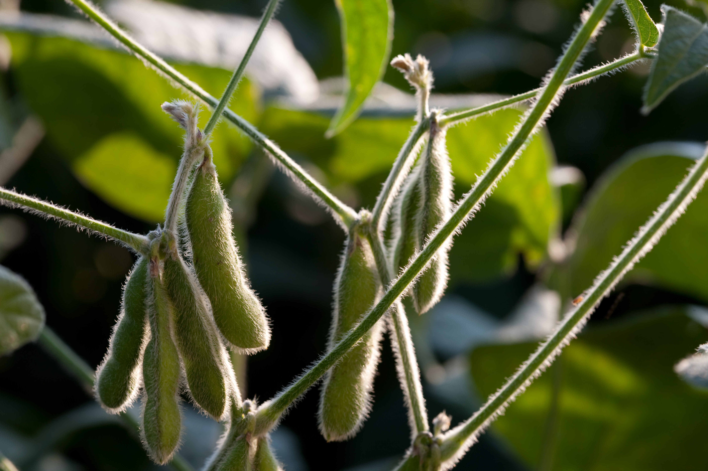

## 摘要

豆一对应国产非转基因食用大豆，2002年大商所上市黄大豆1号合约，主要反映国内食用大豆市场供需。由于国产大豆种植成本较高、规模化程度较低，同时具有较高蛋白含量，因此价格更多受到国内种植面积、产量、食品消费需求以及政策因素影响。

中国长期实行转基因作物进口与国内种植分开的政策。进口大豆主要用于油厂压榨生产豆粕和豆油，因此允许进口转基因大豆；而国内大豆主要面向食品消费市场，以非转基因为主，对品质和安全要求更高。

2024年以来，中国开始逐步推进转基因玉米、大豆产业化试点，向部分企业发放生产经营许可证，探索提高国产大豆、玉米生产效率。但由于国内大豆种植成本较高、规模化程度较低，未来国产大豆仍主要定位于食品消费领域，而进口转基因大豆仍将承担国内油脂和饲料产业的主要供应。

**Mysteel 豆一日报**

[Mysteel 豆一日报：豆一基差交易活跃，市场余粮消化进度偏慢](https://ncp.mysteel.com/a/26042316/8072D68FAB1A366C.html)

## 01 品种概览 {overview}

### 田间大豆豆荚 {wide}

豆1更接近国产非转基因食用大豆的价格体系。
### 豆1研究主线 {checklist narrow}

| 项目 | 说明 |
|---|---|
| 生产 | 面积、天气、单产与粮质 |
| 需求 | 豆制品开机、采购及终端消费 |
| 库存 | 农户余粮、贸易库存、仓单与政策粮 |

| 价格 | 现货、基差、月差与交割品供给 |

## 03 产区与产量 {production}

国产大豆种植范围广，但豆1研究应优先关注东北春大豆区，并兼顾黄淮海夏大豆区。产区面积、单产和品质共同决定当年可进入食用及交割体系的有效供应。

### 中国大豆产区、产量与生长历 {embed}

说明：四图依次展示中国大豆实际生产重心、2020—2025年全国产量折线、主产省集中度饼图，以及东北、黄淮海和西南产区的典型生长季。地图是生产分布示意，不替代行政区划图；饼图用于呈现集中度，精确口径以国家统计局分省年度数据为准。
文件：charts/china-production-atlas.html
初始高度：1450

## 04 生物学与生育期 {biology}

### 主要生物学特性 {wide}

大豆是对光周期较敏感的一年生豆科作物。品种熟期、适宜区、积温和水分条件共同决定产量形成，分析天气时必须先确认作物处于哪个生育阶段。

大豆根系可与根瘤菌共生固氮。合理轮作和接种有助于发挥固氮优势，但大豆并不等于完全不需要氮素；土壤肥力、根瘤活性以及磷、钾和中微量元素仍会影响植株生长与产量形成。

连作容易加重土传病害、线虫和养分失衡风险，因此需要关注大豆与玉米等作物的轮作收益。种植意愿不仅取决于大豆价格，还取决于玉米—大豆比价、种植补贴、地租和单位面积收益。

### 品种适宜区 {narrow}

大豆对光周期较敏感，品种适宜区具有明显边界。低纬或晚熟品种北移，可能因成熟偏晚遭遇早霜；北方早熟品种南移，则可能过早开花、营养生长期不足。

研究扩种时不能只看总亩数，还要确认品种熟期是否匹配、积温是否充足，以及新增地块的土壤、肥力和排水条件。

### 生育阶段与主要风险

| 生育阶段 | 关键条件 | 主要灾害 | 对产量和品质的影响 |
|---|---|---|---|
| 播种—出苗 | 地温、墒情、整地质量 | 低温、干旱、渍水、倒春寒 | 烂种、苗弱、缺苗断垄或重播 |
| 苗期 | 根系、养分和田间管理 | 根腐病、地下害虫、药害 | 降低有效株数和群体质量 |
| 开花—结荚 | 水分与适温 | 高温、干旱、持续渍涝 | 落花落荚、授粉不良、荚数减少 |
| 鼓粒期 | 持续供水、有效积温 | 干旱、早霜 | 粒重下降、青粒和成熟度不足 |
| 成熟—收获 | 晴好天气与机械条件 | 连雨、大风、早雪 | 倒伏、炸荚、霉变和收获损失 |

### 用途
| 用途 | 重点品质 | 价格逻辑 |
|---|---|---|
| 豆腐、豆浆 | 蛋白、色泽、完整粒、加工出品率 | 优质粮和适配品种可能获得溢价 |
| 腐竹及食品蛋白 | 蛋白、品种稳定性、加工性能 | 企业定向采购和订单影响较大 |
| 普通食品加工 | 粒型、损伤粒、杂质与稳定供应 | 随区域供需和采购节奏变化 |
| 压榨或饲用 | 油分、蛋白综合价值和成本 | 用途下沉后向油用豆或替代原料靠拢 |

## 05 豆一的需求 {demand}

豆1的需求研究不能直接套用全国大豆总消费。中国大豆消费总量以压榨为主，但压榨原料主要来自进口大豆；豆1更直接对应国产非转基因大豆的食用加工、种用、区域性压榨及品质替代需求。

### 豆制品加工是核心食用需求 
国产非转基因大豆的食用需求主要来自豆腐、豆浆、腐竹、豆干、植物蛋白饮品和食品配料。不同加工品对蛋白含量、色泽、粒型、完整粒率、吸水率和出品率的要求不同，因此“食用消费总量稳定”并不代表各等级大豆需求同步变化。

研究豆制品需求时，应把人口与餐饮消费等慢变量，同加工厂订单、开机、原料库存和采购价等中高频变量分开。气温升高会缩短鲜豆制品保质期，旺季、节假日和学校开学则可能改变阶段性订单节奏。

### 需求拆分与验证指标 

| 项目 | 说明 |
|---|---|
| 鲜食豆制品 | 豆腐、豆浆等；跟踪区域加工厂开机、订单、原料库存和蛋白价差 |
| 休闲及耐储豆制品 | 豆干、腐竹等；跟踪渠道库存、节假日备货及加工利润 |
| 植物蛋白与食品配料 | 跟踪饮料、蛋白粉、组织蛋白订单及专用品种采购 |
| 种用需求 | 与下一年度播种面积、品种更新和种子商品化率相关 |
| 区域压榨 | 是国产豆的边际去向，取决于国产豆—进口豆价差和油粕价值 |
| 进口非转基因替代 | 主要是品质补充和区域调剂，需看来源、到港、认证及到厂成本 |

##  关联品种 {relations}

### 关系顺序 {relations}

| 类型 | 内容 |
|---|---|
| node | soybean-no1 |
| label | 国产食用豆 |
| node | soybean |
| label | 压榨链条 |
| node | soymeal |
| node | soybean-oil |
